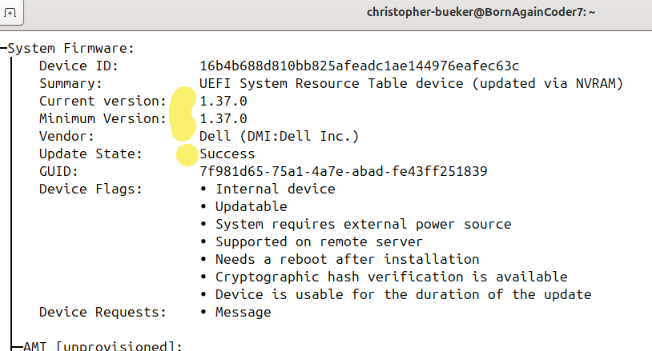
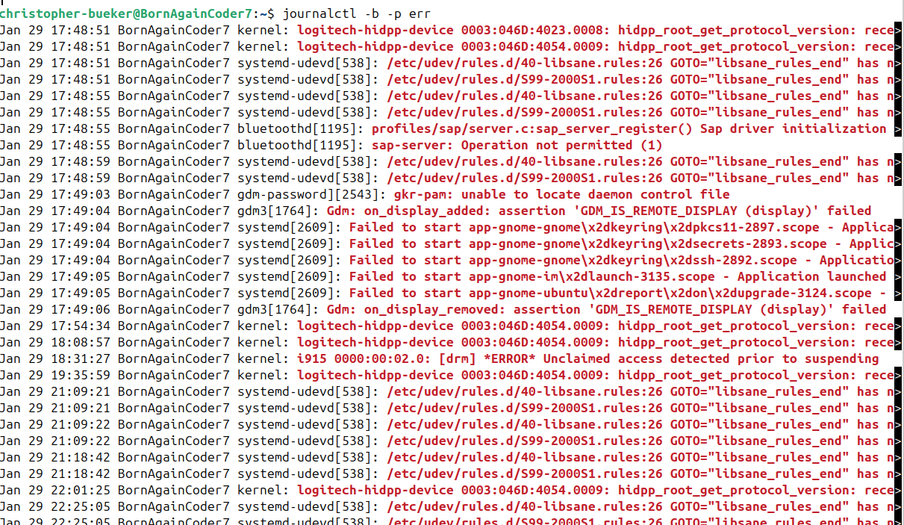

EFI Firmware Recovery

This project documents how I diagnosed and resolved a failed firmware update on a Dell Latitude 7330. The failure was caused by limited space in the EFI partition and included GNOME and system-related startup errors.

The fix involved backing up and recreating the EFI partition, analyzing performance logs, and confirming a successful firmware update.

Summary

- Firmware update failed due to insufficient EFI partition space.
- GNOME services (keyring, display) failed to start properly.
- Logs revealed multiple service-related errors.
- Snap-based applications were removed to improve stability.
- After rebuilding the EFI partition and re-running updates, the firmware installed successfully.
- Final performance checks confirmed normal operation.

Screenshots

Screenshots documenting the full process are located in the `images/` folder:

EFI Partition Error

`df -h /boot/efi` showing limited space

Firmware Update Failed

  

`fwupdmgr` firmware update failed

Firmware Installed Successfully

  

Successful update confirmation

System Firmware Version

Boot Logs Before Fix

`journalctl` errors before recovery

Boot Logs After Fixes

 

Improved logs after fixes

System Performance Check

Output of `free -h`, `uptime`, and `top`

Commands Used

I used these throughout the recovery and verification process.

bash: Check EFI usage
- `df -h /boot/efi`

Backup and rebuild EFI partition
- `sudo cp -r /boot/efi/* ~/efi-backup/`
- `sudo umount /boot/efi`
- `sudo mount /dev/nvme0n1p1 /boot/efi`
- `sudo cp -r ~/efi-backup/* /boot/efi/`

Repair GRUB and chroot into mounted system
- `sudo mount /dev/nvme0n1p5 /mnt`
- `sudo mount --bind /dev /mnt/dev`
- `sudo mount --bind /proc /mnt/proc`
- `sudo mount --bind /sys /mnt/sys`
- `sudo mount --bind /run /mnt/run`
- `sudo chroot /mnt`

Reinstall GRUB bootloader
- `grub-install --target=x86_64-efi --efi-directory=/boot/efi --bootloader-id=Ubuntu --recheck`
- `update-grub`
- `exit`  ← Exit chroot
- `sudo umount -R /mnt`  ← Clean up mounts

Attempt firmware update again
- `sudo fwupdmgr get-updates`
- `sudo fwupdmgr update`

System performance checks
- `free -h`
- `uptime`
- `top`
- `systemd-analyze blame`

Check boot-time errors
- `journalctl -b -p err`

Remove unused Snap apps (optional cleanup)
- `sudo snap remove firefox`
- `sudo snap remove snap-store`
- `sudo snap remove snapd-desktop-integration`

System Info
- Dell Latitude 7330
- Firmware version upgraded from 1.34.1 to 1.37.0
- Ubuntu with GNOME Desktop
- EFI partition: 96MB FAT32 (cleaned for space)
